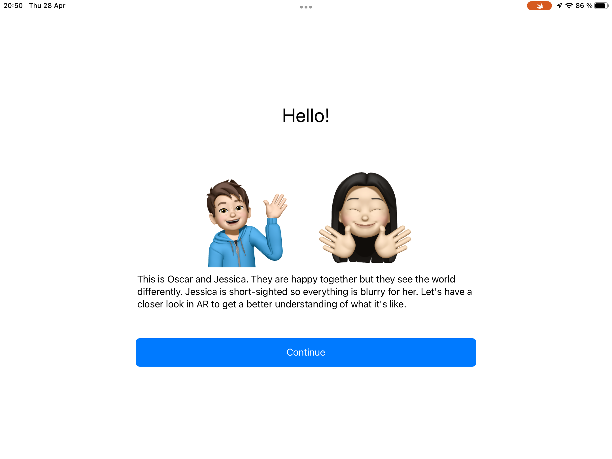
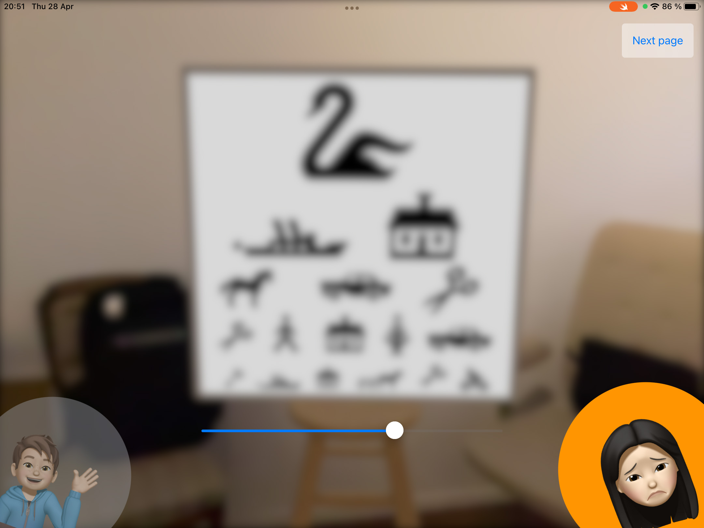
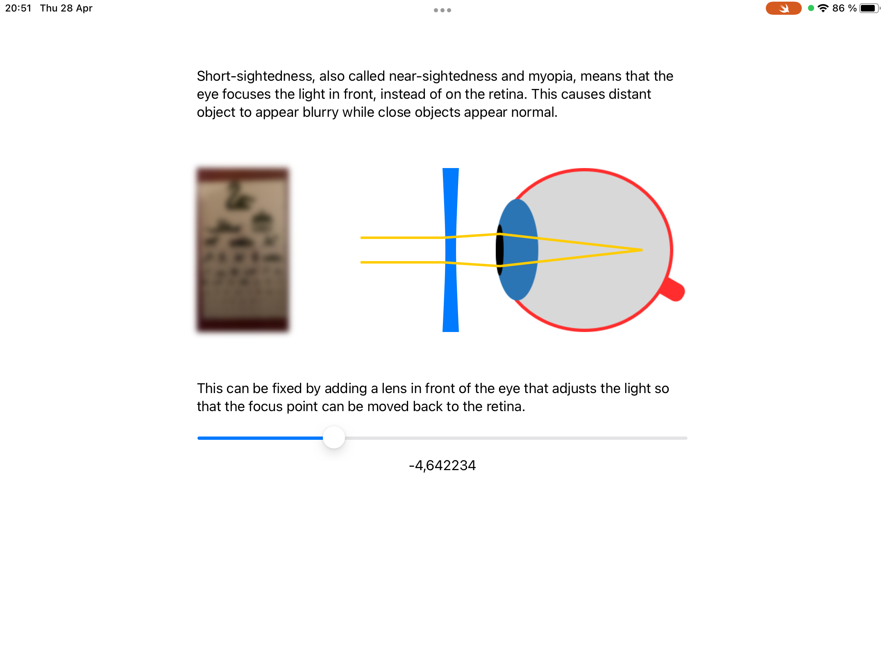
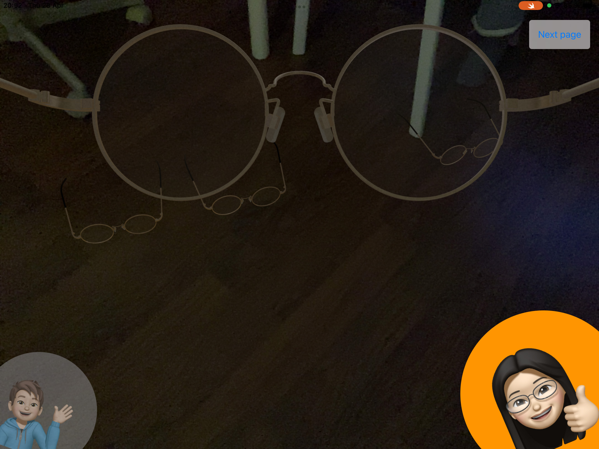
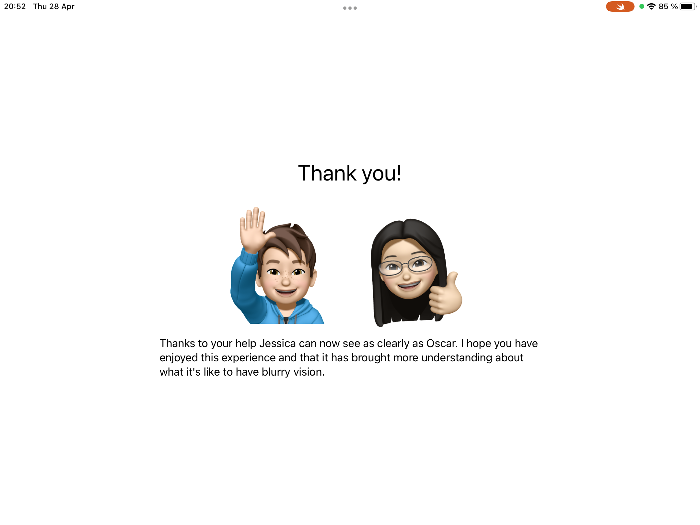

# WWDC22

Here's my application for the Swift Student Challenge 2022

[Download](PlaygroundAppAR.swiftpm.zip)

# About

My playground explores and compares the world from the eyes of Oscar, who has normal vision acuity, and Jessica, who is short-sighted. The user can help Jessica choose the right glasses so that she can see as clearly as Oscar. I hope this playground can help bring more understanding and awareness to our many differences, vision acuity being one of them, which in turn could generate more compassion and kindness in the world.

# Technologies

* ARKit
* RealityKit
* SwiftUI
* UIKit

# Attributions

I used a 3D model of glasses by Dokono Kinokoda, released under Creative Common license - Attribution 4.0 International (CC BY 4.0) https://sketchfab.com/3d-models/glasses-d25f2b7d0b094eea960e7b6c5277e60e